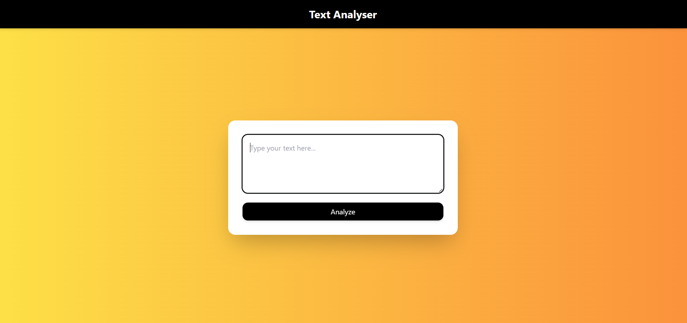
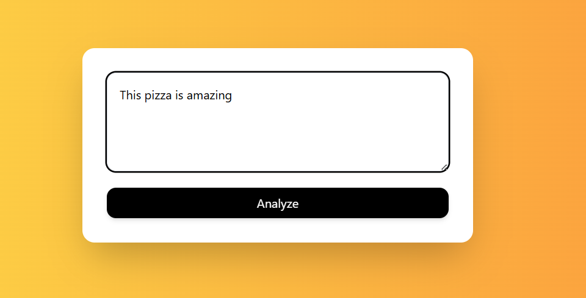
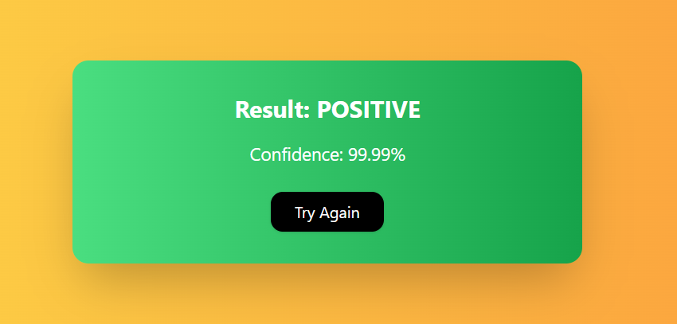
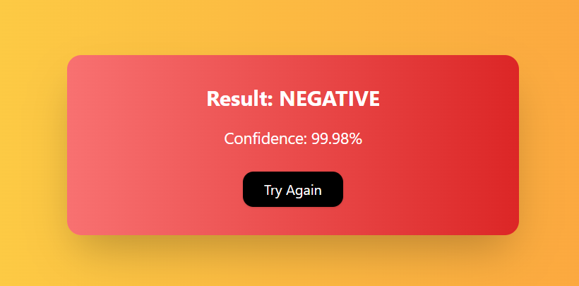

# Sentiment Analyzer

A simple web application that analyzes the sentiment of text using a machine learning model, built with **React** (frontend) and **FastAPI** (backend).

---

## Features

- **Real-time sentiment analysis**: Detects whether a text is positive or negative.
- **Dynamic UI**: Card background changes to **green** for positive sentiment and **red** for negative sentiment.
- **Responsive design** using Tailwind CSS.
- **Try Again** button to reset the input.
- Easy to extend for new models or features.

---

## Tech Stack

- **Frontend**: React, Tailwind CSS, Axios  
- **Backend**: FastAPI, Hugging Face Transformers (for sentiment analysis)  
- **Deployment**: Can be hosted on any service supporting React + Python backend (e.g., Vercel + FastAPI server)

---

## Demo

### Start Screen

### Entering Text

### Positive Sentiment

### Negative Sentiment

